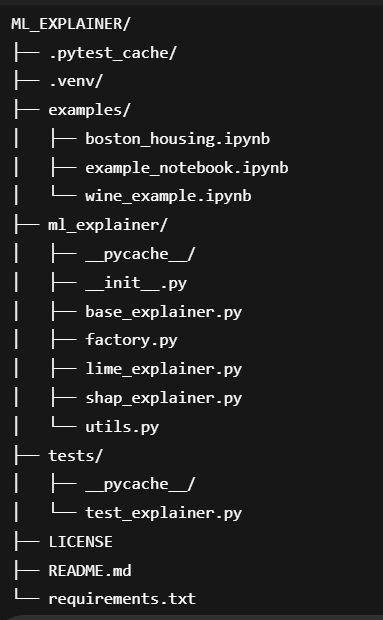

# ML Explainer

A reusable Python component that wraps SHAP and LIME for unified, developer-friendly model explainability.

## Features

- One-line API to explain model predictions
- Supports both SHAP and LIME
- Easy integration in Jupyter notebooks, Python scripts, or apps
- Visualizes explanations for both classification and regression models
- Clean, modular, and extensible codebase

## Installation

Install dependencies with:

```bash
pip install -r requirements.txt
```
## API Reference

### ExplainerFactory

- `ExplainerFactory.get_explainer(model, method="shap", training_data=None, mode="classification")`
  - **model**: Trained machine learning model (e.g., scikit-learn estimator)
  - **method**: `"shap"` or `"lime"` (default: `"shap"`)
  - **training_data**: (Required for LIME) The data used to fit the explainer (e.g., a pandas DataFrame)
  - **mode**: `"classification"` or `"regression"` (for LIME, default: `"classification"`)
  - **Returns**: An explainer object (`SHAPExplainer` or `LIMEExplainer`)

---

### SHAPExplainer

- `explain(input_data)`
  - **input_data**: Data to explain (e.g., a pandas DataFrame or numpy array)
  - **Returns**: SHAP Explanation object

- `visualize(input_data, class_idx=0)`
  - **input_data**: Data to explain (single sample)
  - **class_idx**: (Optional, default: 0) For multi-class models, which class to visualize
  - **Displays**: SHAP waterfall plot for the specified sample and class

---

### LIMEExplainer

- `explain(input_data, sample_idx=0)`
  - **input_data**: Data to explain (e.g., a pandas DataFrame)
  - **sample_idx**: (Optional, default: 0) Index of the sample to explain
  - **Returns**: LIME Explanation object

- `visualize(input_data, sample_idx=0)`
  - **input_data**: Data to explain (e.g., a pandas DataFrame)
  - **sample_idx**: (Optional, default: 0) Index of the sample to visualize
  - **Displays**: LIME explanation visualization in the notebook

---

**All classes and methods include Python docstrings for more details.**
## Usage Example

### SHAP Example

```python
from ml_explainer import ExplainerFactory

# Train your model (example with scikit-learn)
from sklearn.datasets import load_iris
from sklearn.ensemble import RandomForestClassifier

iris = load_iris(as_frame=True)
X, y = iris.data, iris.target
model = RandomForestClassifier().fit(X, y)

# Create explainer and explain a sample
explainer = ExplainerFactory.get_explainer(model, method="shap")
input_data = X.iloc[[0]]
explanation = explainer.explain(input_data)
explainer.visualize(input_data, class_idx=0)  # For multi-class, specify class_idx
```

### LIME Example

```python
from ml_explainer import ExplainerFactory

# Use the same model and data as above
lime_explainer = ExplainerFactory.get_explainer(model, method="lime", training_data=X, mode="classification")
lime_exp = lime_explainer.explain(input_data, sample_idx=0)
print(lime_exp.as_list())
lime_explainer.visualize(input_data, sample_idx=0)
```

## Running Tests

To run the automated tests, use:

```bash
python -m pytest
```

## Project Structure

## Contributing

Pull requests are welcome! For major changes, please open an issue first to discuss what you would like to change.

## License

MIT License

